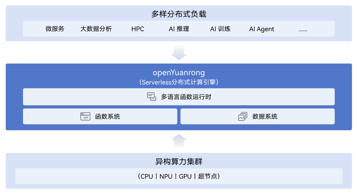

openYuanrong 是一个 Serverless 分布式计算引擎，致力于以一套统一 Serverless 架构支持 AI、大数据、微服务等各类分布式应用。它提供多语言函数编程接口，以单机编程体验简化分布式应用开发；提供分布式动态调度和数据共享等能力，实现分布式应用的高性能运行和集群的高效资源利用。

## 简介

openYuanrong 由多语言函数运行时、函数系统和数据系统组成，支持按需灵活单独或组合使用。

- **多语言函数运行时**：提供函数分布式编程，支持 Python、Java、C++ 语言，实现类单机编程高性能分布式运行。
- **函数系统**：提供大规模分布式动态调度，支持函数实例极速弹性扩缩和跨节点迁移，实现集群资源高效利用。
- **数据系统**：提供异构分布式多级缓存，支持 Object、Stream 语义，实现函数实例间高性能数据共享及传递。

**函数**是 openYuanrong 的核心概念抽象，它对传统 Serverless 函数概念进行了通用化扩展，起到了类似单机 OS 中进程的作用，可以表达任意分布式应用的运行实例，同时天然支持相互调用。

openYuanrong 分为四个代码仓库：[yuanrong](https://gitcode.com/openeuler/yuanrong) 对应多语言函数运行时；[yuanrong-functionsystem](https://gitcode.com/openeuler/yuanrong-functionsystem) 对应函数系统；[yuanrong-datasystem](https://gitcode.com/openeuler/yuanrong-datasystem) 对应数据系统；yuanrong-frontend 提供网关能力，支持函数创建、调用等功能，即当前代码仓。

## 入门

查看 [openYuanrong 文档](https://docs.openyuanrong.org/zh-cn/latest/index.html)了解如何使用 openYuanrong 开发分布式应用。

- 安装：`pip install https://openyuanrong.obs.cn-southwest-2.myhuaweicloud.com/release/0.6.0/linux/x86_64/openyuanrong-0.6.0-cp39-cp39-manylinux_2_34_x86_64.whl`，[更多安装信息](https://docs.openyuanrong.org/zh-cn/latest/deploy/installation.html)。
- [快速入门](https://docs.openyuanrong.org/zh-cn/latest/getting_started.html)

## 贡献

我们欢迎您对 openYuanrong 做各种形式的贡献，请参阅我们的[贡献者指南](https://docs.openyuanrong.org/zh-cn/latest/contributor_guide/index.html)。

## 许可证

[Apache License 2.0](./LICENSE)
